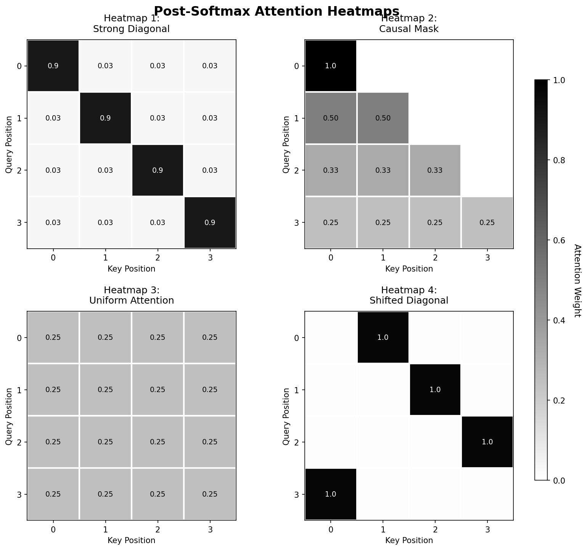

# CS 189/289A - Discussion 11

## Fall 2025

---

> **Note:** Your TA will probably not cover all the problems on this worksheet. The discussion worksheets are not designed to be finished within an hour. They are deliberately made slightly longer so they can serve as resources you can use to practice, reinforce, and build upon concepts discussed in lectures, discussions, and homework.

## This week's cool AI demo/video

- [Anthropic credit research](https://www.youtube.com/watch?v=Y6wiWlcH5jM)
- [Why aren't LLMs deterministic with temperature 0?](https://thinkingmachines.ai/blog/defeating-nondeterminism-in-llm-inference/)

---

## 1. Positional Encoding

### (a)

Why do we need positional encoding? Describe a situation where word-order information is necessary for the task performed.

**Answer (a):**

Self-attention alone has no built-in notion of sequence order: if the input tokens are permuted, the outputs are permuted in the same way. Positional encoding supplies each token with information about where it occurs, allowing the model to distinguish sequences that contain the same words in different orders.

For example, "the man chased the dog" and "the dog chased the man" contain the same words but have different subjects, objects, and meanings. A translation or language model must know this order to interpret or generate the sentence correctly.

### (b)

What is relative positional encoding? How is it different from absolute positional encoding?

**Answer (b):**

With **absolute positional encoding**, position $n$ has an encoding $\mathbf{r}_n$ tied to its absolute index. It is commonly combined with the token embedding, for example as $\mathbf{x}_n+\mathbf{r}_n$, so the representation explicitly identifies whether a token is at position $1$, $2$, and so on.

With **relative positional encoding**, the positional contribution to attention depends on the displacement between a query at position $n$ and a key at position $i$, such as $n-i$, rather than on $n$ and $i$ separately. Thus the same relative relationship is represented identically after shifting the whole sequence, which provides shift invariance and can help generalization to different sequence positions or lengths.

### (c)

Rotary positional embeddings (RoPE) are a way of encoding token positions by rotating pairs of embedding dimensions by an angle that grows with the position index, so that inner products between tokens automatically depend only on their relative positions. They have become a de facto default in many modern LLMs.

Consider a sequence of $N$ two-dimensional vectors

$$
\mathbf{x}_n:=\left(x_n^{(1)},x_n^{(2)}\right),
\qquad n=1,2,\ldots,N.
$$

For a parameter $\theta\in\mathbb{R}$, the RoPE encoding at position $n$ is

$$
\operatorname{RoPE}(\mathbf{x}_n,n)=\mathbf{R}(n\theta)\mathbf{x}_n,
\qquad
\mathbf{R}(\alpha):=
\begin{bmatrix}
\cos\alpha & -\sin\alpha\\
\sin\alpha & \cos\alpha
\end{bmatrix}.
$$

Show that the dot product between two RoPE-encoded vectors depends only on their relative positions. In particular, prove that for any integers $m$, $n$, and $k$,

$$
\begin{aligned}
&\operatorname{RoPE}(\mathbf{x},m)^\top
\operatorname{RoPE}(\mathbf{y},n)\\
&\qquad=\operatorname{RoPE}(\mathbf{x},m+k)^\top
\operatorname{RoPE}(\mathbf{y},n+k).
\end{aligned}
$$

**Answer (c):**

By definition,

$$
\operatorname{RoPE}(\mathbf{x},m)=\mathbf{R}(m\theta)\mathbf{x},
\qquad
\operatorname{RoPE}(\mathbf{y},n)=\mathbf{R}(n\theta)\mathbf{y}.
$$

Rotation matrices satisfy

$$
\mathbf{R}(\alpha)^\top=\mathbf{R}(-\alpha),
\qquad
\mathbf{R}(\alpha)\mathbf{R}(\beta)=\mathbf{R}(\alpha+\beta).
$$

Therefore,

$$
\begin{aligned}
\operatorname{RoPE}(\mathbf{x},m)^\top
\operatorname{RoPE}(\mathbf{y},n)
&=(\mathbf{R}(m\theta)\mathbf{x})^\top
  (\mathbf{R}(n\theta)\mathbf{y})\\
&=\mathbf{x}^\top\mathbf{R}(m\theta)^\top
  \mathbf{R}(n\theta)\mathbf{y}\\
&=\mathbf{x}^\top\mathbf{R}(-m\theta)
  \mathbf{R}(n\theta)\mathbf{y}\\
&=\mathbf{x}^\top\mathbf{R}((n-m)\theta)\mathbf{y}.
\end{aligned}
$$

The result depends on the positions only through the relative displacement $n-m$. If both positions are shifted by any integer $k$, then

$$
\begin{aligned}
\operatorname{RoPE}(\mathbf{x},m+k)^\top
\operatorname{RoPE}(\mathbf{y},n+k)
&=\mathbf{x}^\top
\mathbf{R}(((n+k)-(m+k))\theta)\mathbf{y}\\
&=\mathbf{x}^\top\mathbf{R}((n-m)\theta)\mathbf{y}\\
&=\operatorname{RoPE}(\mathbf{x},m)^\top
\operatorname{RoPE}(\mathbf{y},n).
\end{aligned}
$$

Hence the RoPE-encoded dot product is invariant to a common shift of the two positions.

---

## 2. Matching Similarity Matrices to Attention Heatmaps

Recall that in self-attention mechanisms, we compute the key-query similarity matrix $\mathbf{Q}\mathbf{K}^\top$, scale the matrix by $1/\sqrt{D_k}$, and then apply the softmax function row-wise to obtain attention scores. Understanding how pre-softmax similarity scores translate to post-softmax attention weights is important for interpreting attention patterns. Below are four $4\times4$ pre-softmax similarity matrices and four corresponding post-softmax attention heatmaps. Your task is to match each pre-softmax matrix to its corresponding heatmap and explain the transformation.

Pre-softmax matrices:

$$
\text{Matrix A: }
\begin{bmatrix}
2 & 2 & 2 & 2\\
2 & 2 & 2 & 2\\
2 & 2 & 2 & 2\\
2 & 2 & 2 & 2
\end{bmatrix},
\qquad
\text{Matrix B: }
\begin{bmatrix}
10 & 1 & 1 & 1\\
1 & 10 & 1 & 1\\
1 & 1 & 10 & 1\\
1 & 1 & 1 & 10
\end{bmatrix}.
$$

$$
\text{Matrix C: }
\begin{bmatrix}
5 & -\infty & -\infty & -\infty\\
5 & 5 & -\infty & -\infty\\
5 & 5 & 5 & -\infty\\
5 & 5 & 5 & 5
\end{bmatrix},
\qquad
\text{Matrix D: }
\begin{bmatrix}
-\infty & 5 & -\infty & -\infty\\
-\infty & -\infty & 5 & -\infty\\
-\infty & -\infty & -\infty & 5\\
5 & -\infty & -\infty & -\infty
\end{bmatrix}.
$$

Post-softmax heatmaps (darker means a higher attention weight):

### (a)

Match each pre-softmax matrix (A-D) to its corresponding heatmap (1-4). Provide brief reasoning for each match.

**Answer (a):**

- **Matrix A $\rightarrow$ Heatmap 3:** Every entry in a row is equal. Row-wise softmax therefore assigns each of the four positions weight $1/4=0.25$, producing uniform attention.
- **Matrix B $\rightarrow$ Heatmap 1:** Each diagonal score is much larger than the three off-diagonal scores, so most of each row's probability mass lies on the diagonal.
- **Matrix C $\rightarrow$ Heatmap 2:** Since $e^{-\infty}=0$, the masked upper-triangular entries receive zero weight. The equal finite entries in each row share the probability mass uniformly, producing the causal lower-triangular pattern.
- **Matrix D $\rightarrow$ Heatmap 4:** Each row has exactly one finite entry, at $(0,1)$, $(1,2)$, $(2,3)$, or $(3,0)$. That entry receives weight $1$, producing a shifted diagonal with wraparound.

### (b)

Explain why Matrix C represents a causal attention mask. In what type of model would you typically see this pattern?

**Answer (b):**

Matrix C sets every entry above the main diagonal to $-\infty$. After softmax, those entries have weight zero, so a query at position $i$ can attend only to keys at positions $j\le i$: the current token and earlier tokens, but never future tokens.

This pattern is used in autoregressive Transformer decoders, including decoder-only language models such as GPT. It prevents information leakage from future tokens during next-token prediction while still allowing all training positions to be processed in parallel.

### (c)

Consider a temperature-scaled softmax, $\operatorname{softmax}(\mathbf{x}/T)$, where $T$ is temperature. How would changing $T$ affect the attention distribution for Matrix B? What happens as $T\to0$ and $T\to\infty$?

**Answer (c):**

In each row of Matrix B, the diagonal entry has score $10$ and the three off-diagonal entries have score $1$. With temperature $T>0$, their weights are

$$
p_{\mathrm{diag}}(T)
=\frac{e^{10/T}}{e^{10/T}+3e^{1/T}}
=\frac{1}{1+3e^{-9/T}},
$$

and, for each off-diagonal entry,

$$
p_{\mathrm{off}}(T)
=\frac{e^{1/T}}{e^{10/T}+3e^{1/T}}
=\frac{1}{e^{9/T}+3}.
$$

Lowering $T$ magnifies score differences and makes the attention distribution sharper. In the limit,

$$
T\to0^+:\qquad p_{\mathrm{diag}}(T)\to1,
\qquad p_{\mathrm{off}}(T)\to0,
$$

so Matrix B approaches one-hot attention on the diagonal. Raising $T$ suppresses score differences and flattens the distribution. Since $10/T$ and $1/T$ both approach zero,

$$
T\to\infty:\qquad p_{\mathrm{diag}}(T),p_{\mathrm{off}}(T)\to\frac14,
$$

so every row approaches uniform attention.

---

## 3. KV Caching in Autoregressive Generation

In autoregressive language models like GPT, we generate tokens one at a time, conditioning on all previously generated tokens. This problem explores how KV caching improves the runtime of this process.

### The naive approach

Consider generating a sequence of length $N$ with a transformer that has:

- Model (hidden) dimension $D_{\text{model}}$
- Number of attention heads $H$
- Number of attention layers $L$

Without caching, at iteration $n$ when generating token $y_n$, we compute attention as

$$
\begin{aligned}
&\operatorname{Attention}
(\mathbf{Q}_n,\mathbf{K}_{1:n},\mathbf{V}_{1:n})\\
&\qquad=\operatorname{SoftMax}_{\text{row}}
\left(
\frac{\mathbf{Q}_n\mathbf{K}_{1:n}^\top}
{\sqrt{D_{\text{model}}/H}}
\right)
\mathbf{V}_{1:n},
\end{aligned}
$$

where $\mathbf{K}_{1:n}$ and $\mathbf{V}_{1:n}$ are the keys and values for all tokens from position $1$ to $n$. We recompute $\mathbf{K}_i$ and $\mathbf{V}_i$ for all $i<n$ at every step, even though these values do not change.

### The KV cache solution

We store the computed $\mathbf{K}$ and $\mathbf{V}$ matrices from previous iterations and reuse them, only computing the new $\mathbf{K}_n$ and $\mathbf{V}_n$ for the current token.

### (a)

Without KV caching, how many times do we compute the key and value projections for the first token $y_1$ throughout the entire generation of a sequence of length $N$?

**Answer (a):**

At every generation step $n=1,\ldots,N$, the naive method recomputes the first token's key $\mathbf{K}_1$ and value $\mathbf{V}_1$. Therefore, $\mathbf{K}_1$ is computed $N$ times and $\mathbf{V}_1$ is also computed $N$ times. Equivalently, if key and value projections are counted as separate matrix multiplications, this is $2N$ projection multiplications for the first token in one layer.

### (b)

For a single layer, what is the total number of matrix multiplications needed to compute all key projections $\mathbf{K}_{1:N}$ throughout the entire generation process without KV caching? Assume we compute each $\mathbf{K}_i$ individually at each iteration, i.e., $\mathbf{K}_i=\mathbf{y}_i\mathbf{W}_k$, instead of stacking tokens $i$ up to $n$ into an $n\times D_{\text{model}}$ matrix to compute $\mathbf{K}=\mathbf{X}\mathbf{W}_k$ at each iteration. Express your answer in terms of $N$.

**Answer (b):**

At iteration $n$, the model recomputes the keys of tokens $1$ through $n$, requiring $n$ individual key-projection matrix multiplications. Across the entire generation,

$$
\sum_{n=1}^{N}n
=\frac{N(N+1)}{2}
=\Theta(N^2).
$$

Thus one layer performs $\boxed{N(N+1)/2}$ individual matrix multiplications for the key projections without KV caching.

### (c)

With KV caching, how many matrix multiplications are needed to compute all key projections throughout the entire generation?

**Answer (c):**

With KV caching, each key $\mathbf{K}_n$ is computed once when token $n$ first appears and is then reused. Therefore, computing all $N$ key projections requires

$$
\boxed{N}
$$

matrix multiplications per layer, rather than $N(N+1)/2$.

### (d)

Briefly explain why KV caching is particularly important for applications like chatbots or code assistants that involve multiple rounds of interaction.

**Answer (d):**

In a multi-turn chatbot or code-assistant session, each new message extends an already long context. Without KV caching, the model repeatedly recomputes key and value projections for the entire conversation or code history before producing new tokens. Retaining the cached KV pairs for the existing prefix means that only newly added tokens need new projections. This reduces repeated work and latency, making long-context, interactive generation practical.
