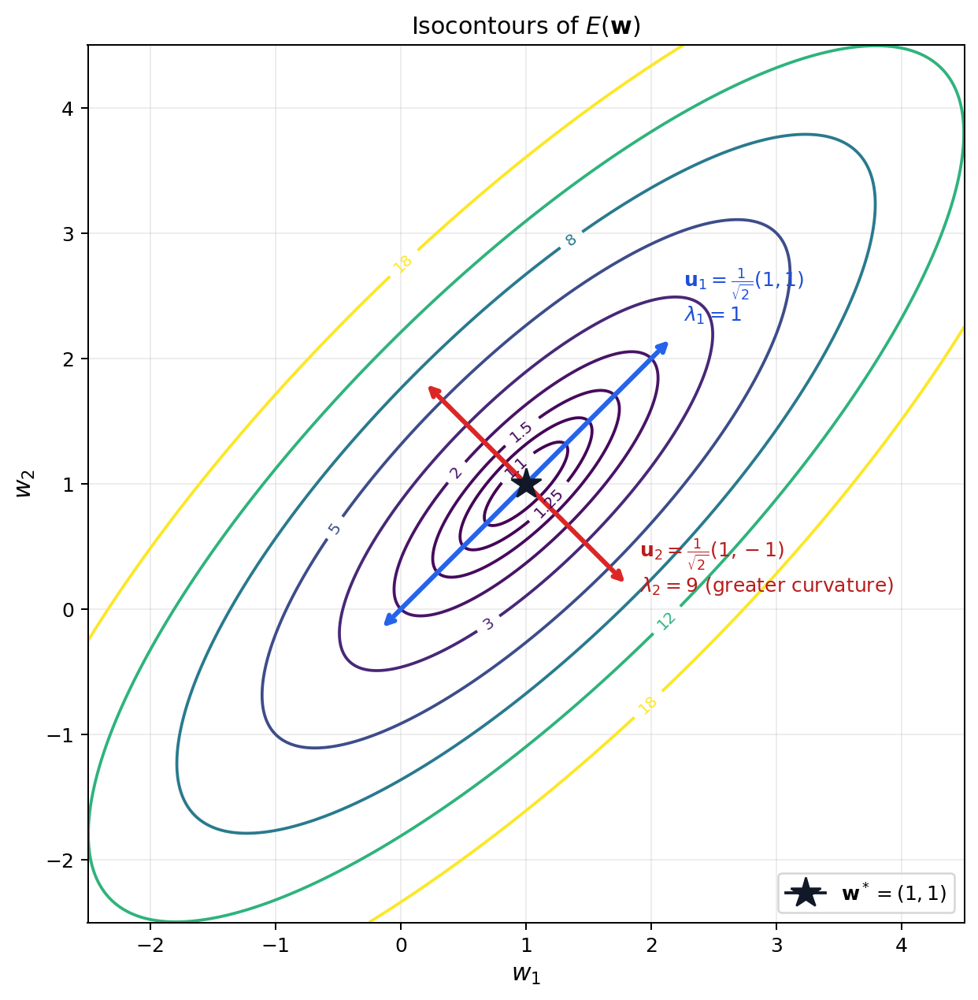

# CS 189/289A - Discussion 7

## Fall 2025

---

> **Note:** Your TA will probably not cover all the problems on this worksheet. The discussion worksheets are not designed to be finished within an hour. They are deliberately made slightly longer so they can serve as resources you can use to practice, reinforce, and build upon concepts discussed in lectures, discussions, and homework.

## This week's cool AI demo/video

- [Figure 3 just dropped](https://www.youtube.com/watch?v=Eu5mYMavctM)
- Sora 2 memes:
  - [Video](https://www.youtube.com/watch?v=7tVlRLQpsO4)
  - [Short 1](https://www.youtube.com/shorts/NCgSr4ljlqA)
  - [Short 2](https://www.youtube.com/shorts/F1UDA3uzHrQ)

---

## 1. Taylor Expansion and Quadratic Forms

In Lecture 13, we saw that the local behavior of an error surface $E(\mathbf{w})$ around a stationary point $\mathbf{w}^*$ can be approximated using its second-order Taylor expansion:

$$
\widetilde{E}_{\mathbf{w}^*}(\mathbf{w})
=E(\mathbf{w}^*)
+\frac{1}{2}(\mathbf{w}-\mathbf{w}^*)^\top
\mathbf{H}(\mathbf{w}-\mathbf{w}^*),
$$

where $\mathbf{H}=\nabla^2E(\mathbf{w}^*)$ is the Hessian matrix describing the local curvature. The eigenvalues and eigenvectors of $\mathbf{H}$ determine the curvature along each principal direction and whether $\mathbf{w}^*$ is a minimum, maximum, or saddle point.

For this question, consider a quadratic error function:

$$
E(\mathbf{w})
=\frac{5}{2}w_1^2-4w_1w_2+\frac{5}{2}w_2^2-w_1-w_2+2.
$$

### (a)

Find the stationary point $\mathbf{w}^*$ of $E(\mathbf{w})$.

*Hint:* Compute the gradient

$$
\nabla E(\mathbf{w})
=
\begin{bmatrix}
\dfrac{\partial E}{\partial w_1}\\[4pt]
\dfrac{\partial E}{\partial w_2}
\end{bmatrix}
$$

and set it equal to zero.

**Answer (a):**
The gradient is

$$
\nabla E(\mathbf{w})
=
\begin{bmatrix}
5w_1-4w_2-1\\
-4w_1+5w_2-1
\end{bmatrix}.
$$

At a stationary point,

$$
5w_1-4w_2=1,
\qquad
-4w_1+5w_2=1.
$$

Adding the two equations gives $w_1+w_2=2$, while subtracting them gives $w_1=w_2$. Therefore,

$$
\boxed{
\mathbf{w}^*
=
\begin{bmatrix}
1\\
1
\end{bmatrix}}
$$

and $E(\mathbf{w}^*)=1$.

### (b)

Compute the Hessian matrix $\mathbf{H}=\nabla^2E(\mathbf{w})$ and determine its eigenvalues $\lambda_1,\lambda_2$ and corresponding unit eigenvectors $\mathbf{u}_1,\mathbf{u}_2$. Based on the signs of the eigenvalues, determine whether $\mathbf{w}^*$ is a local minimum, local maximum, or saddle point.

*Hint:* The Hessian is the matrix of second partial derivatives:

$$
H_{ij}=\frac{\partial^2E}{\partial w_i\partial w_j}.
$$

**Answer (b):**
The Hessian is constant:

$$
\mathbf{H}
=
\begin{bmatrix}
5 & -4\\
-4 & 5
\end{bmatrix}.
$$

Its characteristic equation is

$$
\det(\mathbf{H}-\lambda\mathbf{I})
=(5-\lambda)^2-16
=(\lambda-1)(\lambda-9)=0.
$$

Thus, one choice of unit eigenvectors is

$$
\lambda_1=1,
\qquad
\mathbf{u}_1
=\frac{1}{\sqrt{2}}
\begin{bmatrix}
1\\
1
\end{bmatrix},
$$

$$
\lambda_2=9,
\qquad
\mathbf{u}_2
=\frac{1}{\sqrt{2}}
\begin{bmatrix}
1\\
-1
\end{bmatrix}.
$$

Both eigenvalues are positive, so $\mathbf{H}$ is positive definite. Hence $\mathbf{w}^*$ is a strict local minimum. Since $E$ is a quadratic function with a positive-definite Hessian, it is also the unique global minimum.

### (c)

Use the eigendecomposition of the Hessian to write the second-order Taylor expansion of $E(\mathbf{w})$ around $\mathbf{w}^*$ in the eigenvector basis. Your answer should be in terms of $\alpha_1$ and $\alpha_2$, where $\alpha_i$ is the coordinate of $(\mathbf{w}-\mathbf{w}^*)$ along the direction of $\mathbf{u}_i$.

**Answer (c):**

Let

$$
\mathbf{d}=\mathbf{w}-\mathbf{w}^*
=\alpha_1\mathbf{u}_1+\alpha_2\mathbf{u}_2,
$$

where

$$
\alpha_1
=\mathbf{u}_1^\top\mathbf{d}
=\frac{w_1+w_2-2}{\sqrt{2}},
\qquad
\alpha_2
=\mathbf{u}_2^\top\mathbf{d}
=\frac{w_1-w_2}{\sqrt{2}}.
$$

Using the eigendecomposition of $\mathbf{H}$,

$$
\begin{aligned}
E(\mathbf{w})
&=E(\mathbf{w}^*)+\frac{1}{2}\mathbf{d}^\top\mathbf{H}\mathbf{d}\\
&=1+\frac{1}{2}
\left(\lambda_1\alpha_1^2+\lambda_2\alpha_2^2\right)\\
&=\boxed{1+\frac{1}{2}\alpha_1^2+\frac{9}{2}\alpha_2^2}.
\end{aligned}
$$

Because $E$ is already quadratic, this second-order Taylor expansion is exact.

### (d)

Sketch the isocontours of $E(\mathbf{w})$ and mark $\mathbf{w}^*$. Indicate the eigenvector directions $\mathbf{u}_1$ and $\mathbf{u}_2$, labeling which has the greater curvature.

**Answer (d):**

For a contour with value $E(\mathbf{w})=c$, the expression from part (c) gives

$$
\frac{1}{2}\alpha_1^2+\frac{9}{2}\alpha_2^2=c-1,
$$

or equivalently,

$$
\alpha_1^2+9\alpha_2^2=2(c-1),
\qquad c>1.
$$

Therefore, the isocontours are ellipses centered at $\mathbf{w}^*=(1,1)$. Their long axis is parallel to $\mathbf{u}_1$, which has curvature $\lambda_1=1$, and their short axis is parallel to $\mathbf{u}_2$, which has the greater curvature $\lambda_2=9$.

---

## 2. Momentum vs. SGD

Consider a loss/error function $E(\mathbf{w})$ with parameters $\mathbf{w}\in\mathbb{R}^D$. Recall that the stochastic gradient descent (SGD) update rule is

$$
\mathbf{w}^{(\tau)}
=\mathbf{w}^{(\tau-1)}
-\eta\nabla E\!\left(\mathbf{w}^{(\tau-1)}\right),
$$

where $\eta>0$ is the learning rate and $\tau$ is the iteration number (starting at $0$).

We saw in lecture that we can improve upon vanilla SGD by adding momentum, such that

$$
\Delta\mathbf{w}^{(\tau-1)}
=-\eta\nabla E\!\left(\mathbf{w}^{(\tau-1)}\right)
+\mu\Delta\mathbf{w}^{(\tau-2)},
$$

$$
\mathbf{w}^{(\tau)}
=\mathbf{w}^{(\tau-1)}
+\Delta\mathbf{w}^{(\tau-1)},
$$

where $0\leq\mu<1$ is the momentum parameter and $\Delta\mathbf{w}^{(0)}=0$.

### (a)

In a nearly flat region where the gradient direction stays almost constant, how does momentum affect learning compared to plain SGD?

**(i)** It slows learning down to prevent overshooting.

**(ii)** It keeps the same pace as SGD.

**(iii)** It speeds learning up by accumulating updates in the same direction.

**(iv)** It randomly perturbs the updates to explore more directions.

**Answer (a):**

**(iii)** It speeds learning up by accumulating updates in the same direction.

Suppose the gradient is approximately constant and equal to $\mathbf{g}$. After $t$ consecutive steps in this region, the momentum update contains a geometric sum:

$$
\Delta\mathbf{w}_t
\approx
-\eta\left(1+\mu+\mu^2+\cdots+\mu^{t-1}\right)\mathbf{g}
=-\eta\frac{1-\mu^t}{1-\mu}\mathbf{g}.
$$

The updates therefore reinforce one another. As $t$ grows, their magnitude approaches

$$
\left\lVert\Delta\mathbf{w}_t\right\rVert
\approx
\frac{\eta}{1-\mu}\lVert\mathbf{g}\rVert,
$$

compared with $\eta\lVert\mathbf{g}\rVert$ for plain SGD. Momentum thus moves more quickly along a direction whose gradient remains consistent.

### (b)

In a steep or highly curved region where the gradient direction alternates sign each step (causing oscillations), how does momentum affect the updates?

**(i)** It amplifies oscillations by adding more energy to the updates.

**(ii)** It cancels out part of each new step, smoothing and stabilizing motion.

**(iii)** It leaves the oscillations unchanged.

**(iv)** It reverses the update direction completely.

**Answer (b):**

**(ii)** It cancels out part of each new step, smoothing and stabilizing motion.

When the gradient reverses direction, the new gradient step points opposite to the stored momentum. Their sum is smaller than the new gradient step alone, so repeated back-and-forth motion is damped.

For example, consider

$$
E(w_1,w_2)=w_1^2+10w_2^2,
\qquad
\nabla E(w_1,w_2)=
\begin{bmatrix}
2w_1\\
20w_2
\end{bmatrix},
$$

with $\eta=0.1$. Along the steep $w_2$ direction, plain SGD gives

$$
w_2^{(t+1)}
=w_2^{(t)}-0.1(20w_2^{(t)})
=-w_2^{(t)},
$$

so an initial value $w_2^{(0)}=1$ oscillates forever between $1$ and $-1$. With $\mu=0.9$ and zero initial momentum, the first three updates are

$$
\begin{aligned}
\Delta w_2^{(1)}&=-2,
&w_2^{(1)}&=-1,\\
\Delta w_2^{(2)}&=2+0.9(-2)=0.2,
&w_2^{(2)}&=-0.8,\\
\Delta w_2^{(3)}&=1.6+0.9(0.2)=1.78,
&w_2^{(3)}&=0.98.
\end{aligned}
$$

The coordinate still changes sign, but the stored update partially offsets each reversal and the oscillation decays over time.
