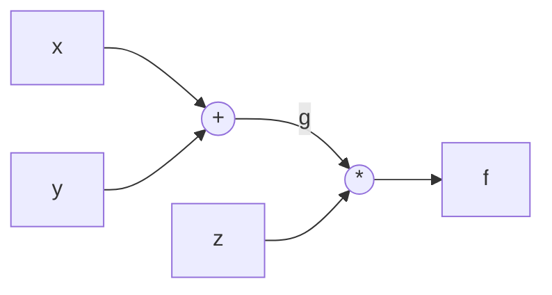
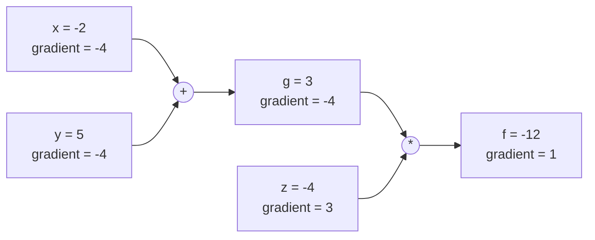
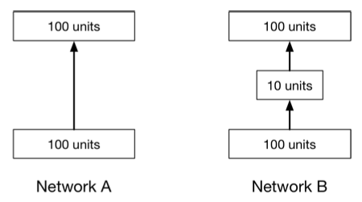

# CS 189/289A - Discussion 8

## Fall 2025

---

> **Note:** Your TA will probably not cover all the problems on this worksheet. The discussion worksheets are not designed to be finished within an hour. They are deliberately made slightly longer so they can serve as resources you can use to practice, reinforce, and build upon concepts discussed in lectures, discussions, and homework.

## This week's cool AI demo/video

- [Anduril EagleEye](https://www.youtube.com/watch?v=x9B02pFKpJo)
- [Guess who (temporarily) tanked Google's market cap by 100B with one tweet](https://www.youtube.com/watch?v=Ej6hnsQgV_c)

---

## 1. Backprop in Practice: Staged Computation

We will apply backpropagation for the function

$$
f(x,y,z)=(x+y)z.
$$

### (a)

Decompose $f$ into two simpler functions.

**Answer (a):**

Introduce the intermediate variable

$$
g(x,y)=x+y.
$$

The original function is then the composition

$$
f(g,z)=gz.
$$

### (b)

Draw the computation graph that represents $f$ following the composition from part (a).

**Answer (b):**

The addition gate first computes $g=x+y$. The multiplication gate then combines $g$ and $z$ to produce $f=gz$.

### (c)

Write the steps of the forward pass and backward pass through the network.

**Answer (c):**

The forward pass evaluates the graph from the inputs to the output:

$$
g=x+y,
\qquad
f=gz.
$$

For the backward pass, seed the output derivative with

$$
\frac{\partial f}{\partial f}=1.
$$

Backpropagating through the multiplication $f=gz$ gives

$$
\frac{\partial f}{\partial g}=z,
\qquad
\frac{\partial f}{\partial z}=g.
$$

The addition $g=x+y$ has local derivatives

$$
\frac{\partial g}{\partial x}=1,
\qquad
\frac{\partial g}{\partial y}=1.
$$

Applying the chain rule gives the input derivatives:

$$
\frac{\partial f}{\partial x}
=\frac{\partial f}{\partial g}
\frac{\partial g}{\partial x}
=z,
\qquad
\frac{\partial f}{\partial y}
=\frac{\partial f}{\partial g}
\frac{\partial g}{\partial y}
=z.
$$

### (d)

Update your network drawing with the intermediate values in the forward and backward pass using the inputs $x=-2$, $y=5$, and $z=-4$.

**Answer (d):**

The forward pass produces

$$
g=x+y=-2+5=3,
\qquad
f=gz=3(-4)=-12.
$$

Starting with $\partial f/\partial f=1$, the backward pass gives

$$
\frac{\partial f}{\partial g}=z=-4,
\qquad
\frac{\partial f}{\partial z}=g=3,
$$

and then

$$
\frac{\partial f}{\partial x}
=\frac{\partial f}{\partial g}\frac{\partial g}{\partial x}
=(-4)(1)=-4,
\qquad
\frac{\partial f}{\partial y}
=\frac{\partial f}{\partial g}\frac{\partial g}{\partial y}
=(-4)(1)=-4.
$$

The completed graph is

Here, each gradient is the derivative of the final output $f$ with respect to that node's value:

| Node | Forward value | Backward gradient |
| --- | ---: | ---: |
| $x$ | $-2$ | $\partial f/\partial x=-4$ |
| $y$ | $5$ | $\partial f/\partial y=-4$ |
| $z$ | $-4$ | $\partial f/\partial z=3$ |
| $g$ | $3$ | $\partial f/\partial g=-4$ |
| $f$ | $-12$ | $\partial f/\partial f=1$ |

---

## 2. A Two Layer Neural Network

Consider a neural network with two fully connected layers but no nonlinearities. The network maps input $\mathbf{x}\in\mathbb{R}^2$ to output $y\in\mathbb{R}$ according to

$$
\mathbf{h}=\mathbf{W}_1\mathbf{x},
\qquad
y=\mathbf{W}_2\mathbf{h},
$$

where $\mathbf{W}_1\in\mathbb{R}^{2\times2}$ and $\mathbf{W}_2\in\mathbb{R}^{1\times2}$. We define the loss as the mean squared error

$$
L=\frac{1}{2}(y-t)^2,
$$

where $t$ is the target output.

### (a)

Write the steps of the forward pass and backward pass through the network.

*Hint:* You may find the following gradient identities useful:

$$
\begin{aligned}
\text{(i)}\quad &\frac{\partial}{\partial\mathbf{x}}(\mathbf{a}^\top\mathbf{x})=\mathbf{a},
&\text{(ii)}\quad &\frac{\partial}{\partial\mathbf{A}}(\mathbf{a}^\top\mathbf{A}\mathbf{x})=\mathbf{a}\mathbf{x}^\top,
&\text{(iii)}\quad &\frac{\partial}{\partial\mathbf{x}}(\mathbf{A}\mathbf{x})=\mathbf{A},\\[6pt]
\text{(iv)}\quad &\frac{\partial L}{\partial\mathbf{x}}
=\frac{\partial L}{\partial y}\frac{\partial y}{\partial\mathbf{x}},
&\text{(v)}\quad &\frac{\partial L}{\partial\mathbf{x}}
=\left(\frac{\partial\mathbf{y}}{\partial\mathbf{x}}\right)^\top
\frac{\partial L}{\partial\mathbf{y}},
&\text{(vi)}\quad &\frac{\partial L}{\partial\mathbf{A}}
=\sum_{i,j}\frac{\partial L}{\partial Y_{ij}}\frac{\partial Y_{ij}}{\partial\mathbf{A}}.
\end{aligned}
$$

Here $y$ is a scalar, $\mathbf{a}$, $\mathbf{x}$, and $\mathbf{y}$ are vectors, and $\mathbf{A}$ and $\mathbf{Y}$ are matrices.

**Answer (a):**

The forward pass computes each quantity from the input to the loss:

$$
\mathbf{h}=\mathbf{W}_1\mathbf{x},
\qquad
y=\mathbf{W}_2\mathbf{h},
\qquad
L=\frac{1}{2}(y-t)^2.
$$

For the backward pass, first differentiate the loss with respect to the scalar output:

$$
\frac{\partial L}{\partial y}=y-t.
$$

Backpropagating through the second layer gives

$$
\frac{\partial L}{\partial \mathbf{W}_2}
=(y-t)\mathbf{h}^{\top},
\qquad
\frac{\partial L}{\partial \mathbf{h}}
=\mathbf{W}_2^{\top}(y-t).
$$

Backpropagating through the first layer then gives

$$
\frac{\partial L}{\partial \mathbf{W}_1}
=\frac{\partial L}{\partial \mathbf{h}}\mathbf{x}^{\top}
=\mathbf{W}_2^{\top}(y-t)\mathbf{x}^{\top}.
$$

If the gradient with respect to the input is also required, it is

$$
\frac{\partial L}{\partial \mathbf{x}}
=\mathbf{W}_1^{\top}\frac{\partial L}{\partial \mathbf{h}}
=\mathbf{W}_1^{\top}\mathbf{W}_2^{\top}(y-t).
$$

The gradient dimensions match their corresponding variables:

$$
\frac{\partial L}{\partial \mathbf{W}_2}\in\mathbb{R}^{1\times2},
\qquad
\frac{\partial L}{\partial \mathbf{h}}\in\mathbb{R}^{2},
\qquad
\frac{\partial L}{\partial \mathbf{W}_1}\in\mathbb{R}^{2\times2}.
$$

### (b)

Write out $y$ directly in terms of $\mathbf{x}$ and the weights $\mathbf{W}_1,\mathbf{W}_2$.

**Answer (b):**

Substituting $\mathbf{h}=\mathbf{W}_1\mathbf{x}$ into the second-layer equation gives

$$
\boxed{y=\mathbf{W}_2\mathbf{W}_1\mathbf{x}}.
$$

Thus, without a nonlinearity, the two-layer network is equivalent to a single linear layer whose weight matrix is $\mathbf{W}=\mathbf{W}_2\mathbf{W}_1$.

### (c)

Suppose you insert a nonlinearity $h(\cdot)$ after the first layer so that $\mathbf{h}=h(\mathbf{W}_1\mathbf{x})$. Why does this change what the network can represent? Illustrate using a simple example with ReLU.

**Answer (c):**

Without a nonlinearity, composing two linear layers still produces a linear function:

$$
y=\mathbf{W}_2\mathbf{W}_1\mathbf{x}.
$$

Adding a nonlinear activation between the layers changes the mapping to

$$
y=\mathbf{W}_2h(\mathbf{W}_1\mathbf{x}),
$$

which generally cannot be reduced to a single linear transformation. The network can therefore represent nonlinear, piecewise-linear functions and more complicated decision boundaries.

For example, consider a one-dimensional input $x$ and the ReLU activation

$$
\operatorname{ReLU}(u)=\max(0,u).
$$

Using two hidden units, let

$$
\mathbf{h}
=
\begin{bmatrix}
\operatorname{ReLU}(x)\\
\operatorname{ReLU}(-x)
\end{bmatrix},
\qquad
y=
\begin{bmatrix}1&1\end{bmatrix}\mathbf{h}.
$$

Then

$$
y=\operatorname{ReLU}(x)+\operatorname{ReLU}(-x)=|x|.
$$

The absolute-value function is nonlinear, so a purely linear network without an activation function cannot represent it for all $x$.

---

## 3. Model Intuition

### (a)

What can go wrong if you initialize all the weights in a neural network to exactly zero? What about initializing them to the same nonzero value?

**Answer (a):**

If all weights are initialized to zero, neurons in the same layer start identically and receive identical gradients. They therefore remain identical during training instead of learning different features. In addition, because backpropagation multiplies by weights from later layers, zero weights can cause the gradients of earlier layers to be zero at the start of training.

Initializing every weight to the same nonzero value may avoid some zero-gradient behavior, but it does not solve the symmetry problem. All neurons in a layer still compute the same function and receive the same updates, so the layer behaves as though it had only one effective neuron. Random initialization breaks this symmetry and allows different neurons to learn different features.

### (b)

Adding nodes in the hidden layer gives the neural network more approximation ability because you are adding more parameters. How many weight parameters are there in a neural network with architecture specified by

$$
\mathbf{n}=\left[n^{(0)},n^{(1)},\ldots,n^{(\ell)}\right],
$$

a vector giving the number of nodes in each of the $\ell+1$ layers? Layer $0$ is the input layer, and layer $\ell$ is the output layer. Evaluate your formula for a network $\mathbf{n}=[8,10,10,3]$.

**Answer (b):**

Each pair of consecutive layers contributes

$$
n^{(i-1)}n^{(i)}
$$

weights. Therefore, excluding bias parameters, the total number of weights is

$$
\boxed{\sum_{i=1}^{\ell}n^{(i-1)}n^{(i)}}.
$$

For $\mathbf{n}=[8,10,10,3]$, the number of weights is

$$
8\cdot10+10\cdot10+10\cdot3
=80+100+30
=\boxed{210}.
$$

### (c)

Consider the two networks in the image below, where the added layer in Network B has 10 units with linear activation. Give one advantage of Network A over Network B, and one advantage of Network B over Network A.

**Answer (c):**

Network A uses one $100\times100$ weight matrix, so it has $10{,}000$ weight parameters and can represent any linear transformation from $\mathbb{R}^{100}$ to $\mathbb{R}^{100}$.

Network B uses a $10\times100$ matrix followed by a $100\times10$ matrix, so it has only

$$
10\cdot100+100\cdot10=2{,}000
$$

weight parameters. Because the added layer has a linear activation, Network B is still equivalent to a single linear transformation. However, the bottleneck restricts its effective weight matrix to rank at most $10$.

Thus, an advantage of Network A is greater expressive power: it can represent transformations with rank as high as $100$. An advantage of Network B is efficiency: it requires fewer parameters, less memory, and less computation, while its low-rank constraint may also reduce overfitting when the underlying mapping is approximately low-rank.
