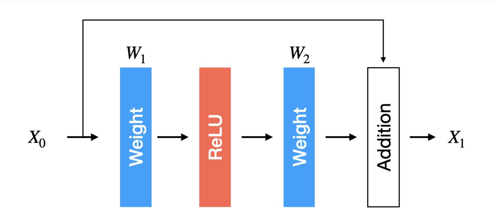
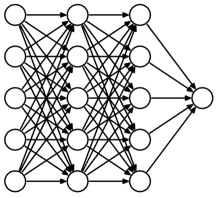
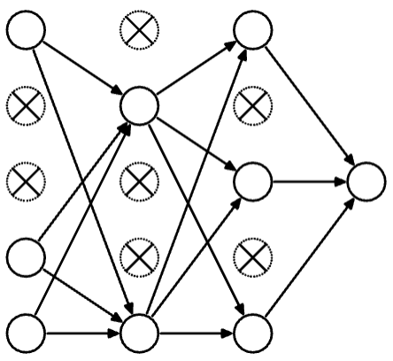

# CS 189/289A - Discussion 9

## Fall 2025

---

> **Note:** Your TA will probably not cover all the problems on this worksheet. The discussion worksheets are not designed to be finished within an hour. They are deliberately made slightly longer so they can serve as resources you can use to practice, reinforce, and build upon concepts discussed in lectures, discussions, and homework.

## This week's cool AI demo/video

- [Extropic TSU](https://www.youtube.com/watch?v=Y28JQzS6TlE)

---

## 1. Convolution Operation in CNNs

In this question, we will look at the mechanism of weight sharing in convolutions. Suppose that we have an input vector with $D=9$ dimensions:

$$
\mathbf{x}=
\begin{bmatrix}
x_1 & x_2 & \cdots & x_9
\end{bmatrix}^\top.
$$

We compute a 1D convolution with the kernel filter that has $K=3$ weights (parameters):

$$
\mathbf{k}=
\begin{bmatrix}
k_1 & k_2 & k_3
\end{bmatrix}^\top.
$$

### (a)

What is the output dimension if we apply filter $\mathbf{k}$ with no padding and a stride of $1$? What is the first element of the output? What is the last element?

**Answer (a):**

With no padding and stride $1$, the output length is

$$
D-K+1=9-3+1=\boxed{7}.
$$

Using the cross-correlation convention commonly used in neural networks, the first and last output elements are

$$
x'_1=k_1x_1+k_2x_2+k_3x_3,
$$

$$
x'_7=k_1x_7+k_2x_8+k_3x_9.
$$

### (b)

What is the output dimension if we apply filter $\mathbf{k}$ with padding of size $1$ and a stride of $2$? What is the first element of the output? What is the second element?

**Answer (b):**

Padding the input with one zero on each side gives

$$
\begin{bmatrix}
0 & x_1 & x_2 & \cdots & x_9 & 0
\end{bmatrix}^{\top}.
$$

The output length is

$$
\left\lfloor\frac{D+2p-K}{s}\right\rfloor+1
=\left\lfloor\frac{9+2(1)-3}{2}\right\rfloor+1
=\boxed{5}.
$$

The first output uses the window $[0,x_1,x_2]^{\top}$, and the second window begins two positions later:

$$
x'_1=k_1(0)+k_2x_1+k_3x_2
=k_2x_1+k_3x_2,
$$

$$
x'_2=k_1x_2+k_2x_3+k_3x_4.
$$

### (c)

Recall that CNN filters have the property of weight sharing, meaning that different portions of an image can share the same weight to extract the same set of features. A convolution is a linear operation, which we can express as $\mathbf{x}'=\mathbf{K}\mathbf{x}$ for some weight matrix $\mathbf{K}$. Find $\mathbf{K}$ for the convolution applied in part (a). What is its dimension?

**Answer (c):**

The convolution from part (a) can be represented by the Toeplitz matrix

$$
\mathbf{K}=
\begin{bmatrix}
k_1 & k_2 & k_3 & 0   & 0   & 0   & 0   & 0   & 0\\
0   & k_1 & k_2 & k_3 & 0   & 0   & 0   & 0   & 0\\
0   & 0   & k_1 & k_2 & k_3 & 0   & 0   & 0   & 0\\
0   & 0   & 0   & k_1 & k_2 & k_3 & 0   & 0   & 0\\
0   & 0   & 0   & 0   & k_1 & k_2 & k_3 & 0   & 0\\
0   & 0   & 0   & 0   & 0   & k_1 & k_2 & k_3 & 0\\
0   & 0   & 0   & 0   & 0   & 0   & k_1 & k_2 & k_3
\end{bmatrix}.
$$

Therefore,

$$
\mathbf{x}'=\mathbf{K}\mathbf{x},
\qquad
\boxed{\mathbf{K}\in\mathbb{R}^{7\times9}}.
$$

The repeated appearances of $k_1,k_2,k_3$ in different rows show weight sharing explicitly: all output locations use the same three learned parameters.

### (d)

Consider a 2-dimensional example with the following kernel filter and image:

$$
\mathbf{K}=\frac{1}{4}
\begin{bmatrix}
1 & 1\\
1 & 1
\end{bmatrix},
\qquad
\mathbf{X}=
\begin{bmatrix}
1 & 2 & 3\\
4 & 5 & 6\\
7 & 8 & 9
\end{bmatrix}.
$$

Using no padding and a stride of $1$, compute the output and describe the effect of this filter.

**Answer (d):**

Each output entry is the average of one $2\times2$ patch. Thus,

$$
\mathbf{X}'=
\frac14
\begin{bmatrix}
1+2+4+5 & 2+3+5+6\\
4+5+7+8 & 5+6+8+9
\end{bmatrix}
=
\boxed{
\begin{bmatrix}
3 & 4\\
6 & 7
\end{bmatrix}}.
$$

This is a $2\times2$ averaging or box-blur filter. It smooths the image by replacing each local patch with its mean, reducing sharp local variations and high-frequency detail.

### (e)

We want the general formula for computing the output dimension of a convolution operation. Suppose we have a square input image of dimension $W\times W$ and a $K\times K$ kernel filter. If we assume a stride of $1$ and no padding, what is the output dimension $W'$? If we apply a stride of $s$ and padding of size $p$, how would the dimension change?

**Answer (e):**

With stride $1$ and no padding, each spatial dimension of the output is

$$
\boxed{W'=W-K+1},
$$

so the complete output has shape $(W-K+1)\times(W-K+1)$.

With stride $s$ and padding of $p$ pixels on each side, the output size along each spatial dimension is

$$
\boxed{W'=\left\lfloor\frac{W+2p-K}{s}\right\rfloor+1}.
$$

Therefore, for a square input and square kernel, the output has shape $W'\times W'$.

---

## 2. L2 Regularization and Weight Decay

Derive the stochastic gradient descent (SGD) update rule when we add an $L_2$ regularization term $\lambda\lVert\mathbf{w}\rVert^2$ to an error function $E(\mathbf{w})$, and explain why we refer to this as weight decay regularization.

**Answer:**

After adding $L_2$ regularization, the objective becomes

$$
\widetilde{E}(\mathbf{w})
=E(\mathbf{w})+\lambda\lVert\mathbf{w}\rVert_2^2.
$$

Its gradient is

$$
\nabla_{\mathbf{w}}\widetilde{E}(\mathbf{w})
=\nabla_{\mathbf{w}}E(\mathbf{w})+2\lambda\mathbf{w}.
$$

Therefore, with learning rate $\eta$, one SGD step is

$$
\begin{aligned}
\mathbf{w}_{t+1}
&=\mathbf{w}_t-
\eta\left(\nabla E_{\mathcal{B}_t}(\mathbf{w}_t)
+2\lambda\mathbf{w}_t\right)\\
&=\boxed{(1-2\eta\lambda)\mathbf{w}_t
-\eta\nabla E_{\mathcal{B}_t}(\mathbf{w}_t)},
\end{aligned}
$$

where $\mathcal{B}_t$ is the example or mini-batch sampled at step $t$.

The factor $(1-2\eta\lambda)$ shrinks every weight toward zero at each update, independently of the gradient of the original error. This repeated multiplicative shrinking is why the method is called **weight decay**. It discourages excessively large weights and can reduce overfitting.

If the regularizer is instead defined using the common convention $\frac{\lambda}{2}\lVert\mathbf{w}\rVert^2$, the corresponding decay factor is $(1-\eta\lambda)$.

---

## 3. Vanishing Gradients and ResNets

The deeper a neural network grows, the more likely it will suffer from vanishing gradients because downstream layers (i.e., earlier layers) are the product of many backpropagated gradients, any of which may be close to zero. This question explores one approach to address vanishing gradients.

### (a)

The vanishing gradient problem can arise from saturating activation functions, such as the sigmoid,

$$
s(x)=\frac{1}{1+e^{-x}}.
$$

What is the maximum gradient of the sigmoid function? Why might ReLU be more preferable than the sigmoid function in deep networks?

**Answer (a):**

The derivative of the sigmoid is

$$
s'(x)=s(x)(1-s(x)).
$$

Because $0<s(x)<1$, this derivative is maximized when $s(x)=\frac12$, which occurs at $x=0$. Therefore,

$$
\boxed{\max_x s'(x)=\frac14}.
$$

In a deep network, backpropagation repeatedly multiplies gradients by activation derivatives. Sigmoid derivatives are at most $1/4$ and approach zero when the input is strongly positive or negative, so gradients can shrink rapidly across many layers. For an active ReLU unit,

$$
\operatorname{ReLU}'(x)=1 \quad \text{when }x>0,
$$

so it can pass gradients without this additional shrinkage and is often easier to optimize in deep networks. ReLU can still have zero gradient for $x<0$, which is the dying-ReLU limitation.

### (b)

One common way to tackle vanishing gradients is by adding residual connections. The figure below shows a simplified example of a residual block. Assuming that the weights consist of an affine layer with zero biases, write an expression for $X_1$ in terms of $W_1$, $W_2$, and $X_0$.

**Answer (b):**

Along the main branch, the block first computes $W_1X_0$, applies ReLU, and then applies $W_2$. The skip connection adds the original input directly to this result. Hence,

$$
\boxed{X_1=X_0+W_2\operatorname{ReLU}(W_1X_0)}.
$$

### (c)

Compute the gradient $\dfrac{\partial X_1}{\partial X_0}$. Based on what you see numerically, why does a residual connection preserve gradient norms better? You may assume $X_0$ and $X_1$ are scalar.

**Answer (c):**

For scalar $X_0$ and $X_1$,

$$
\frac{\partial X_1}{\partial X_0}
=1+W_2W_1\operatorname{ReLU}'(W_1X_0).
$$

Away from the nondifferentiable point $W_1X_0=0$, this is

$$
\boxed{
\frac{\partial X_1}{\partial X_0}
=
\begin{cases}
1+W_2W_1, & W_1X_0>0,\\
1, & W_1X_0<0.
\end{cases}}
$$

The additive $1$ comes from the identity skip connection. It provides a direct gradient path that does not multiply through $W_1$, ReLU, and $W_2$. In particular, even when the ReLU branch has zero derivative, the gradient through the block is still $1$. Across many residual blocks, this identity contribution helps prevent gradients from repeatedly shrinking toward zero.

---

## 4. Dropout

In this question, we explore dropout as a form of regularization. Recall that when we apply dropout during training, we randomly turn off individual nodes, as shown below.

| Original (and final) network | Network during dropout training |
| --- | --- |
|  |  |

### (a)

Explain qualitatively how dropout regularization works and why we can view dropout as simulating an ensemble of many "sub-networks." Describe what happens during training when dropout is applied to a neural network's neurons.

**Answer (a):**

During each training step, dropout independently samples a binary mask for the selected layer. A dropped neuron has its activation set to zero, so all of its outgoing contributions are removed for that step. A new mask is normally sampled for every example or mini-batch.

Each mask selects a different subset of neurons and connections, so each training step effectively trains a different sub-network. Because all these sub-networks share parameters, dropout efficiently approximates training and averaging a large ensemble of models rather than explicitly storing every model. This discourages co-adaptation between particular neurons and encourages features that remain useful under many different masks.

At test time, all neurons are used. Either their activations or outgoing weights are multiplied by the keep probability, or inverted dropout is used during training so that no test-time scaling is necessary.

### (b)

Dropout has a tendency to prevent any one weight from growing excessively large, compared with other weights in the network. Why would that be?

**Answer (b):**

Because a neuron or one of its inputs may disappear on any training step, the network cannot reliably place all responsibility on a single connection. It must distribute predictive information across multiple paths so that the prediction remains useful under different dropout masks.

A very large weight also makes the network's output highly sensitive to whether its associated unit is kept or dropped, increasing the variance of the prediction and the expected loss under dropout noise. Optimization therefore tends to avoid isolated, excessively large weights and reduces co-adaptation among neurons. In this sense, dropout has a regularizing effect similar to an adaptive penalty on the weights.

### (c)

Consider a ReLU layer that computes $\mathbf{z}=h(\mathbf{W}\mathbf{x})$, where $\mathbf{x}$ represents the nodes in some layer, $\mathbf{z}$ represents the nodes in the subsequent layer, $\mathbf{W}$ is the weight matrix connecting those two layers, and $h(\cdot)$ is the ReLU activation function applied element-wise to a vector. Recall that the backpropagation step updates the weights in $\mathbf{W}$ by computing

$$
\nabla_{\mathbf{w}_i}L
=\frac{\partial L}{\partial z_i}
h'(\mathbf{w}_i\cdot\mathbf{x})\mathbf{x},
\qquad
\mathbf{w}_i\leftarrow\mathbf{w}_i-\eta\nabla_{\mathbf{w}_i}L,
$$

where $L$ is the loss function for a training point, $\mathbf{w}_i$ is the $i$th row of $\mathbf{W}$, and $\eta$ is the learning rate/step size. If dropout turns off some fraction of the units in both layers of hidden units, how should we implement this backpropagation step?

**Answer (c):**

Let $\mathbf{m}_x$ and $\mathbf{m}_z$ be binary dropout masks for the input and output layers, respectively, with independent entries sampled from $\operatorname{Bernoulli}(p)$. With inverted dropout, define

$$
\widetilde{\mathbf{x}}
=\frac{\mathbf{m}_x}{p}\odot\mathbf{x},
\qquad
\widetilde{\mathbf{z}}
=\frac{\mathbf{m}_z}{p}\odot
h(\mathbf{W}\widetilde{\mathbf{x}}).
$$

Backpropagation must reuse the same masks that were sampled during the forward pass. For row $i$ of $\mathbf{W}$,

$$
\boxed{
\nabla_{\mathbf{w}_i}L
=\frac{m_{z,i}}{p}
\frac{\partial L}{\partial\widetilde{z}_i}
h'(\mathbf{w}_i\cdot\widetilde{\mathbf{x}})
\widetilde{\mathbf{x}}}.
$$

Thus, if output unit $i$ is dropped, $m_{z,i}=0$ and its entire row receives zero gradient. If an input unit $j$ is dropped, $\widetilde{x}_j=0$, so weights connected to that input receive zero contribution. Only connections between active units are updated. For ordinary dropout rather than inverted dropout, the same masking rule applies but the factors of $1/p$ are omitted.

### (d)

Consider a single neuron receiving some input during training with dropout. Derive an expression for the expected output of this neuron (pre-activation) under dropout. Assume a fixed input and weight configuration, and that each unit is dropped independently with a given probability. You may assume a "keep probability" $p$ for each unit, i.e., each neuron is retained with probability $p$ during training. Show how this relates to the test-time behavior of scaling weights or activations.

**Answer (d):**

Let $m_j\sim\operatorname{Bernoulli}(p)$ independently indicate whether input unit $j$ is kept. Without inverted scaling, the neuron's pre-activation during training is

$$
a_{\text{train}}=\sum_j w_jm_jx_j.
$$

Since $\mathbb{E}[m_j]=p$,

$$
\begin{aligned}
\mathbb{E}[a_{\text{train}}]
&=\sum_j w_jx_j\mathbb{E}[m_j]\\
&=p\sum_jw_jx_j
=p\,\mathbf{w}^{\top}\mathbf{x}.
\end{aligned}
$$

Therefore, if ordinary dropout is used during training, the deterministic test-time computation should scale the full activation or the weights by $p$:

$$
a_{\text{test}}=p\,\mathbf{w}^{\top}\mathbf{x}.
$$

Equivalently, inverted dropout scales retained inputs by $1/p$ during training:

$$
a_{\text{train}}^{\text{inv}}
=\sum_jw_j\frac{m_j}{p}x_j.
$$

Then

$$
\mathbb{E}[a_{\text{train}}^{\text{inv}}]
=\mathbf{w}^{\top}\mathbf{x},
$$

so the ordinary unscaled computation $a_{\text{test}}=\mathbf{w}^{\top}\mathbf{x}$ can be used at test time. If a bias $b$ is present, it is not dropped and is simply added to each expectation above.
